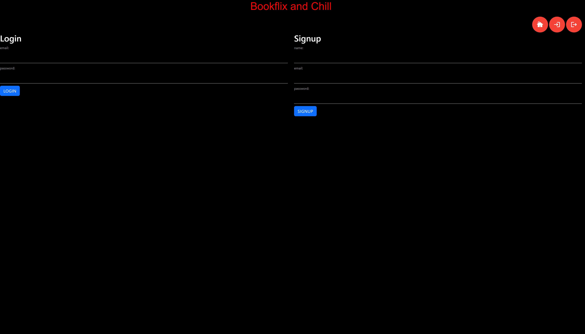

# Book-Database

## Description

- Motivation: Our motivation for this project was to create an application where u can view several books and see who they were created by and reviews from other users.
- Goal: We built this project to fully test our knowleadge from the passing "unit". This is our second preoject we have done now and time does fly really fast, and so do the classes. Due to this fact it becomes hard to really see if your grasping the subject at hand and this project really tested wheather or not we were able to create an application with what we have learned
- Problems Solved: The problems this particular application solves is being able to see what others thought about a book you amy be deciding to read
- What I Learned: We learned many thing throughout the process of creating this porject, one of the most important thing is how valuable sleep is. This porject was definatly a lot harder then we thought it would be and it also did not help that whenever we saw a cool idea on the internet we wanted to replicate it and that cool idea would take many hours to complete. Another thing we learned thorught the process of creating this program was routing can be really annoying and so can spell chicking. Spent about an hour trying to figure out where the code was going wrong turns out the issue was "submit" was spelt "sumbit".

## Contents

- This project content `package.json` with the required dependencies and data base files schema.sql and seeds.sql.

## Installation

- Doesn't need any instillation just run mysql first then run the server.js in the command line by "npm start" .

## Usage

- This application can be used by anyone who want to read a book and find the reviews about that particular book.

## GitHub link

[The E-Commerce Back End](https://github.com/JohnDavidSmith/E-commerce-BackEnd-ORM-Mod13)

## Heroku link

https://drive.google.com/file/d/1YtYbKl6Dyj0X1t0iP8RVIanmTXtg-Drx/view

## Credits

- Albi krasniqi
- Griffin Pelletier

## License

N/A

## Questions

GitHub: https://github.com/JohnDavidSmith/Book-Database
GitHub: https://github.com/Albikras
GitHub: GirffinGithub

If you want to reach me or any of my contributors with additional question click my email link here: Johns@email, krasniqi1287@gmail.com, Griffins@email

## How to Contribute

## Screenshot

